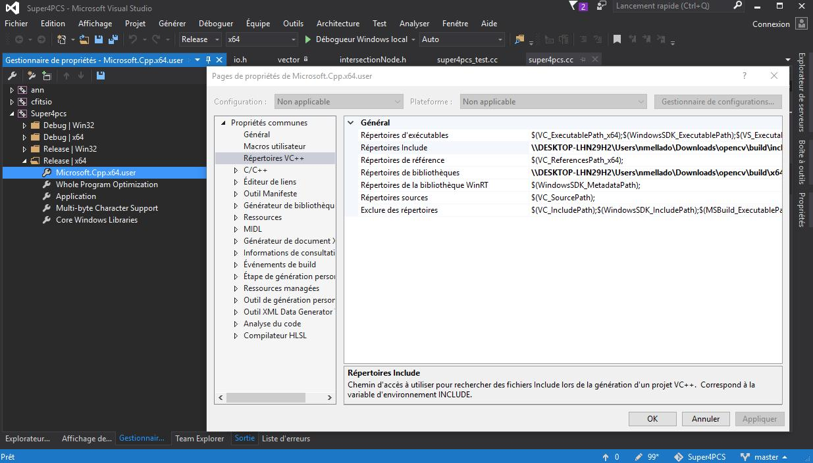

# Compilation  {#compilation}
Super4PCS is now supported for Linux, MacOS and Windows platforms, with continuous testing.
This file reviews the following aspects:
* how to compile and install the library, tests and applications: [here](#library)
* how to use the library in your own software: [here](#usage)
* a note about compilation mode and performances: [here](#perfs)

**Note:** Super4PCS relies heavily on CMake for its compilation and use (minimum version: v3.3).

## <a name="library"></a> Compiling the library, application and tests
For people in a hurry:
```bash
git clone https://github.com/STORM-IRIT/OpenGR.git
mkdir build
cd build
cmake .. -DCMAKE_BUILD_TYPE=Release -DCMAKE_INSTALL_PREFIX=./install
make install
cd install/scripts/
./run-example.sh
```

### Dependencies
Super4PCS takes care of its own dependencies, and downloads them when required. As a result, **you may need an internet connection for the first compilation**.

The libraries and the standalone application require:
* [Eigen](http://eigen.tuxfamily.org/). The library is automagically downloaded and configured by the cmake process. If you need to force using Eigen from a specific path, call CMAKE with `-DEIGEN3_INCLUDE_DIR=/path/to/eigen`.

IO and tests:
* [Boost-filesystem](http://www.boost.org/doc/libs/1_57_0/libs/filesystem/doc/index.htm), used to read dataset folders. Requires Boost version: 1.57 or more.

### CMake Options
Our CMake scripts can be configured using the following options:
* Compilation rules
    * `OPTION (SUPER4PCS_COMPILE_TESTS "Enable testing" TRUE)`
    * `OPTION (SUPER4PCS_COMPILE_DEMOS "Compile demo applications (including the Super4PCS standalone)" TRUE)`
    * `OPTION (IO_USE_OPENCV "Use OpenCV for texture loading" TRUE)`
    * `OPTION (SUPER4PCS_USE_CHEALPIX "Use Chealpix for orientation filtering (deprecated)" FALSE)` We recommend to keep this option to `FALSE`.
* Advanced functionalities
    * `+OPTION (SUPER4PCS_USE_WEIGHTED_LCP "Use gaussian weights for point samples when computing LCP" FALSE)` Was implicitely set to `FALSE` in previous release.
* Extras
    * `OPTION (DL_DATASETS "Download demo datasets and associated run scripts" FALSE)`
* Debug options
    * `OPTION (ENABLE_TIMING "Enable computation time recording" FALSE)`

Options can be set by calling `cmake -DMY_OPTION=TRUE`, or by editing the file [CMakeList.txt](https://github.com/nmellado/Super4PCS/blob/master/CMakeLists.txt) (not recommended).

### Compilation targets
Our CMAKE scripts provide several targets:
* `install`: build the libraries, the main application and install them to a dedicated folder alongside with demo scripts and assets. This is **recommended** target. The installation folder is by default: `ROOT_DIR/Super4PCS-${Super4PCS_VERSION_MAJOR}.${Super4PCS_VERSION_MINOR}`.
It can be customized by calling cmake with `-DINSTALL_DIR=your_path`.
* `all`/`Super4PCS`: build the libraries and the main Super4PCS application,
* `buildtests`: compile tests. This target is generated only if `SUPER4PCS_BUILD_TEST` option is set to `TRUE`,
* `test`: run the tests locally
* `dl-datasets`: download the demo datasets.

### Installed directories structure:
After compilation and installation, you should obtain the following structure:
```
installation-directory/
  - assets     -> contains the demo hippo files, and the downloaded datasets if any
  - bin        -> contains the main Super4PCS application
  - include    -> header files of the Super4PCS library
  - lib        -> library binaries: super4pcs_algo and super4pcs_io, and chealpix if compiled
  - lib/cmake  -> cmake package files
  - scripts    -> demo scripts allowing to register the hippo meshes
```

***

### Linux and MacOS Builds
Nothing specific here, just call:
```bash
mkdir build
cd build
cmake -DCMAKE_BUILD_TYPE=Release ..
make install
```

***

### Windows Builds
Super4PCS requires c++11 features and CMake support. We recommend to use Microsoft Visual Studio 2017 with [CMake plugin](https://blogs.msdn.microsoft.com/vcblog/2016/10/05/cmake-support-in-visual-studio/). CMake standalone is also supported (and used for Continuous Integration on AppVeyor).

By default, the project can be opened and compiled straight away with no parameter setting.

If you want to compile with OpenCV and/or Boost support, the dependency directories must be properly configured in Visual Studio.
They can be set either when calling [CMake](https://blogs.msdn.microsoft.com/vcblog/2016/10/05/cmake-support-in-visual-studio/#configure-cmake) or globally by configuring Visual Studio (see how-to [here](https://social.msdn.microsoft.com/Forums/vstudio/en-US/a494abb8-3561-4ebe-9eb0-6f644a679862/visual-studio-2010-professional-how-to-add-include-directory-for-all-projects?forum=vcgeneral#7b5ab5f2-f793-4b0e-a18a-679948d12bdd)).


***

## <a name="usage"></a> Use Super4PCS library in your own application
**From release v.1.1.2**, Super4PCS provides a CMake package, generated during the installation process.
To use it in your own application, add the following lines to your project file:
```cmake
project(Super4PCS-externalAppTest)
cmake_minimum_required(VERSION 3.3)

set (CMAKE_CXX_STANDARD 11)

find_package(Super4PCS REQUIRED)
include_directories(${Super4PCS_INCLUDE_DIR})
link_directories(${Super4PCS_LIB_DIR})

add_executable(${PROJECT_NAME} main.cpp)
target_link_libraries(${PROJECT_NAME} ${Super4PCS_LIBRARIES})

# we also need eigen
find_package( Eigen3 REQUIRED )
include_directories( ${EIGEN3_INCLUDE_DIR} )
```

In addition, CMake must be ran so that `CMAKE_PREFIX_PATH` contains `Super4PCS_install_dir/lib/cmake` when compiling `Super4PCS-externalAppTest`.

Super4PCS files will be located in the `super4pcs` folder. For instance, to use the Super4PCS algorithm:
```c++
#include <super4pcs/algorithms/super4pcs.h>
```
This functionality is tested by our continuous integration system. Checkout the [externalAppTest](https://github.com/nmellado/Super4PCS/tree/master/tests/externalAppTest) for a working example.

## <a name="perfs"></a> Debug mode and performances
Note that we heavily use template mechanisms that requires to enable inlining in order to be efficient. Compiling in Debug mode without inlining may result in longer running time than expected.
