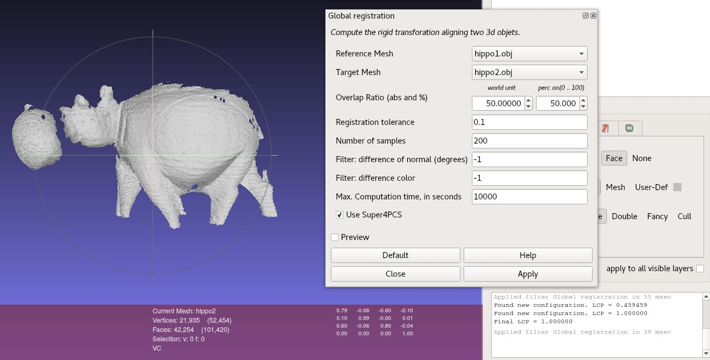

# Scripts, Demos and wrappers {#demos}

Starting from v1.1.3, the library is shipped with applications demonstrating how to use the library.

## Standalone demo
This is the original command line application, allowing to register two views of the same object or scene.
It is available at `install_dir/bin/Super4pcs`.

To compile, call:

    make Super4PCS

See the @ref usage page for more details.

## Meshlab Plugin
> You need to compile the library from source to use this feature.

A Meshlab plugin can be generated from the library.
Since we do not want to carry the full Meshlab repository, we assume that Meshlab source code can be found somewhere close to the Super4PCS sources (check `cmake/FindMeshlab.cmake` for more details).
We thus provide a cmake target `Meshlab_install_plugin` that will generate a Meshlab plugin source files, and put them in `meshlab_dir/src/meshlabplugins/filter_globalregistration`:
 - `filter_globalregistration.pro`: which properly set the link and include directories to compile the plugin
 - `globalregistration.h` and `globalregistration.cpp`: the plugin source code
 - `readme.md`: which gives you the instructions to follow to add the GlobalRegistration plugin to the Meshlab plugin compilation list.

Note that we also copy libraries and include files in the `meshlab_dir/src/external folder`.

To compile, call

    make Meshlab_install_plugin
    cd meshlab_dir/src
    # Follow instructions from meshlabplugins/filter_globalregistration/readme.md
    qmake meshlab_full.pro && make

The plugin can be found in Meshlab in `Filter > Point set > Global Registration`, or using the filter search engine.

## PCLWrapper
Provides a wrapper to use Super4PCS within the Point Cloud Library, and implementing `pcl::Registration<PointSource, PointTarget>`.

The wrapper source code is available at `install_dir/include/pcl/registration`. Note that our file structure follows the PCL source code organization.

A command line application demonstrating how to use the wrapper is available here: `install_dir/bin/Super4PCS-PCLWrapper`.
To compile, call:

    make Super4PCS-PCLWrapper

The source code of the demo application is quite simple:

~~~~~~~~~~~~~{.cpp}
using namespace GlobalRegistration;

// Align a rigid object to a scene with clutter and occlusions
int
main (int argc, char **argv)
{
  // Point clouds
  PointCloudT::Ptr object (new PointCloudT);
  PointCloudT::Ptr object_aligned (new PointCloudT);
  PointCloudT::Ptr scene (new PointCloudT);

  // Get input object and scene
  if (argc < 4)
  {
    pcl::console::print_error ("Syntax is: %s scene.obj object.obj [PARAMS]\n", argv[0]);
    Demo::printParameterList();
    return (-1);
  }

  // Load object and scene
  pcl::console::print_highlight ("Loading point clouds...\n");
  if (pcl::io::loadOBJFile<PointNT> (argv[2], *object) < 0 ||
      pcl::io::loadOBJFile<PointNT> (argv[1], *scene) < 0)
  {
    pcl::console::print_error ("Error loading object/scene file!\n");
    return (-1);
  }

  // Load Super4pcs parameters
  Demo::getArgs(argc, argv);

  pcl::Super4PCS<PointNT,PointNT> align;
  Demo::setOptionsFromArgs(align.options_);

  // Perform alignment
  pcl::console::print_highlight ("Starting alignment...\n");
  align.setInputSource (object);
  align.setInputTarget (scene);

  {
    pcl::ScopeTime t("Alignment");
    align.align (*object_aligned);
  }

  if (align.hasConverged ())
  {
    // Print results
    printf ("\n");
    Eigen::Matrix4f transformation = align.getFinalTransformation ();
    pcl::console::print_info ("    | %6.3f %6.3f %6.3f | \n", transformation (0,0), transformation (0,1), transformation (0,2));
    pcl::console::print_info ("R = | %6.3f %6.3f %6.3f | \n", transformation (1,0), transformation (1,1), transformation (1,2));
    pcl::console::print_info ("    | %6.3f %6.3f %6.3f | \n", transformation (2,0), transformation (2,1), transformation (2,2));
    pcl::console::print_info ("\n");
    pcl::console::print_info ("t = < %0.3f, %0.3f, %0.3f >\n", transformation (0,3), transformation (1,3), transformation (2,3));
    pcl::console::print_info ("\n");

    // Show alignment
    pcl::visualization::PCLVisualizer visu("Alignment - Super4PCS");
    visu.addPointCloud (scene, ColorHandlerT (scene, 0.0, 255.0, 0.0), "scene");
    visu.addPointCloud (object_aligned, ColorHandlerT (object_aligned, 0.0, 0.0, 255.0), "object_aligned");
    visu.spin ();
  }
  else
  {
    pcl::console::print_error ("Alignment failed!\n");
    return (-1);
  }

  return (0);
}
~~~~~~~~~~~~~
