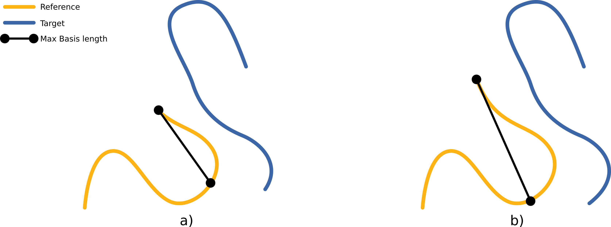

# Usage {#usage}

In this page we review the main parameters of the Super4PCS algorithm, and how to use them properly to efficiently register point-clouds.
We also list and describe difficult configurations that may arise sometime, how to detect them and sort them out.

Specific cases are described in dedicated pages:
 - @subpage usage-partinwhole

To get the exhaustive list of Super4PCS parameters, run the executable found in `${CMAKE_INSTALL_PREFIX}/bin/` directory:

    ./Super4PCS -h

In the current version, you should get

    Usage: ./Super4PCS -i input1 input2
        [ -o overlap (0.20) ]
        [ -d delta (5.00) ]
        [ -n n_points (200) ]
        [ -a norm_diff (90.000000) ]
        [ -c max_color_diff (150.000000) ]
        [ -t max_time_seconds (10) ]
        [ -r result_file_name (output.obj) ]
        [ -x (use 4pcs: false by default) ]

Each parameter is described by its string identifiers, followed by the default value between (). Note that all parameters string must be followed by a value, except -x, the option to use 4PCS instead of Super4PCS.

**Note for 4PCS users:**
>Super4PCS comes with exactly the same interface than 4PCS. So you can use the same settings, you should get similar results.
>In case you need it, Super4PCS also includes the original 4PCS procedure. You can call it by adding -x to your command line.

## Playing with parameters
### Parameters overview
The three main parameters of the algorithm (overlap. number of samples, and accuracy) are described in the following sections.

The `-a` and `-c` parameters defines threshold used to filter pairs according to their consistency, regarding normal angles and rgb values respectively.
This filtering is enabled only when the associated fields are loaded from the input files.

Super4PCS explores the transformation space to align the two input clouds.
The maximum time allowed to the process is set using the option `-t`.
Since the exploration is performed randomly, it is recommended to use a large time value to explore the whole space (e.g., `-t 1000`).

### Overlap estimation (-o)
This parameter defines the amount of expected overlap between the two clouds: it is ranging between 0 (no overlap) to 1 (100% overlap).

The overlap parameter controls the size of the basis used for registration, as shown in the Figure below:

Usually, the larger the overlap, the faster the algorithm.
When the overlap is unknown, a simple way to set this parameter is to start from 100% overlap, and decrease the value until obtaining a good result.
Using too small values will slow down the algorithm, and reduce the accuracy of the result.

### Number of samples (-n)
Input clouds are sub-sampled prior exploration, to ensure fast computations.
Super4PCS has a linear complexity wrt the number of input samples, allowing to use larger values than 4PCS.
Simple geometry with large overlap can be matched with only 200 samples.
However, with Super4PCS, smaller details can be used during the process by using up to thousands of points.
There is no theoretical limit to this parameter, however using too large values leads to very a large congruent set, which requires more time and memory to be explored.

Using a large number of samples is recommended when:
* **geometrical details** are _required_ to perform the matching, for instance to disambiguate between several similar configurations,
* the clouds have a very low **overlap**: using a too sparse sampling can prevent to have samples in the overlapping area, causing the algorithm to fail,
* the clouds are very **noisy**, and require a dense sampling.

Note that Super4PCS is a global registration algorithm, which finds a good _approximate_ of the rigid transformation aligning too clouds.
Increasing the number of samples in order to get a fine registration is not optimal: it is usually faster to use less samples, and refine the transformation using a local algorithm, like the [ICP](http://pointclouds.org/documentation/tutorials/iterative_closest_point.php), or its variant [SparseICP](https://github.com/OpenGP/sparseicp).

### Registration accuracy (-d)
This parameter controls the registration accuracy (delta in the paper) : setting a small value means that the two clouds needs to be very close to be considered as well aligned. It is expressed in scene units.

A simple way to understand its impact is to consider the computation of the Largest Common Pointset (LCP), the metric used to verify how much the clouds are aligned.
For each transformation matrix produced by Super4PCS, we compute the LCP measure by considering a shell around the reference cloud, and count the % of points of the target cloud lying in the shell. The thickness of the shell is defined by the parameter delta.

The LCP values are given in the standard output:

        ./run-example.sh
        Use Super4PCS
        create tree
        create tree ... DONE (5281 points)
        Work with 414 points
        norm_max_dist: 0.010000
        Initial LCP: 0.004831
        Score: 0.748792
with 0.4% points lying in the shell at the beginning of the process, and 74.8% at the end. (If you want to test the exemple, make sure that you are in `build/install/scripts` directory before running the exemple.sh)

Using too wide values will slow down the algorithm by increasing the size of the congruent set, while using to small values prevents to find a solution.
This parameter impacts other steps of the algorithm, see the paper for more details.

